# 📊 Customer Churn Analysis

An exploratory data analysis (EDA) of telecom customer churn using **Python, Pandas, Matplotlib, and Seaborn** — identifying the key factors that drive customers to leave, and surfacing insights that could inform retention strategy.

---

## 📁 Dataset

The analysis uses the **Telco Customer Churn** dataset (`Customer Churn.csv`) — **7,043 customer records** with **21 attributes**, including:

- **Demographics** — gender, senior citizen status, partner, dependents
- **Account info** — tenure, contract type, payment method, billing
- **Services** — phone, internet, online security, tech support, streaming, etc.
- **Target** — `Churn` (Yes/No)

---

## 🛠️ Tech Stack

- `pandas` — data loading, cleaning, and manipulation
- `numpy` — numerical operations
- `matplotlib` — plotting
- `seaborn` — statistical visualizations

---

## 🧹 Data Cleaning

- Converted `TotalCharges` from object to `float` (blank values imputed as `0`)
- Recoded `SeniorCitizen` from `0`/`1` to a `Yes`/`No` categorical field
- Verified no duplicate customer IDs and no missing values

---

## 🔍 Key Insights

| Driver | Finding | Churn Rate |
|---|---|---|
| **Contract Type** | Churn drops sharply as commitment length increases | 42.7% (month-to-month) → 11.3% (1-yr) → 2.8% (2-yr) |
| **Tenure** | Churn is concentrated among newer customers | Highest in first few months |
| **Senior Citizens** | Churn nearly double that of non-seniors | 41.7% vs 23.6% |
| **Payment Method** | Electronic check users churn far more than autopay users | 45.3% vs 15–19% |
| **Security/Support Add-ons** | Lack of OnlineSecurity/TechSupport correlates with higher churn | Add-ons improve retention |
| **Streaming Services** | Minimal effect on churn | No strong pattern |
| **Gender** | No meaningful difference | ~equal churn rate |

---

## 📸 Screenshots

### 1. Dataset Preview
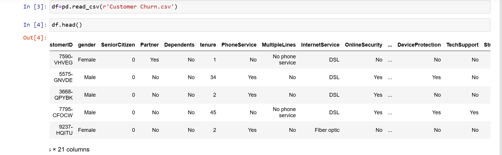

### 2. Dataset Structure & Data Types
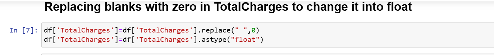

### 3. Cleaning `TotalCharges`
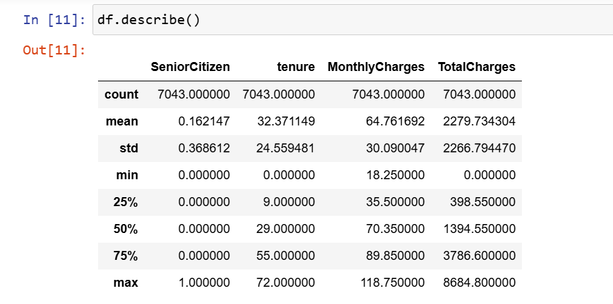

### 4. Missing Values Check
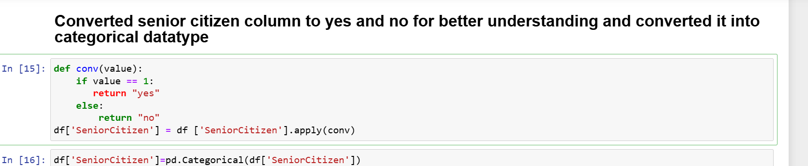

### 5. Statistical Summary
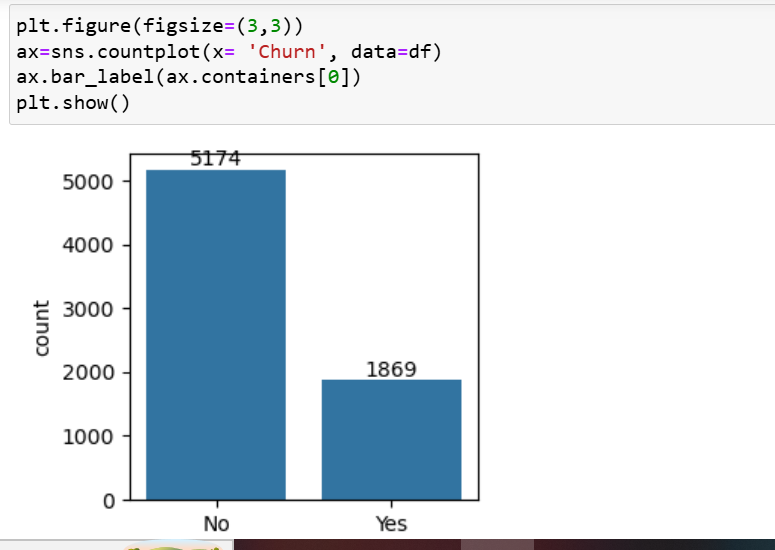

### 6. Overall Churn Distribution
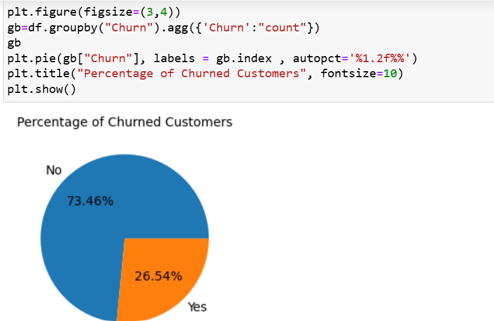

### 7. Churn Percentage Breakdown
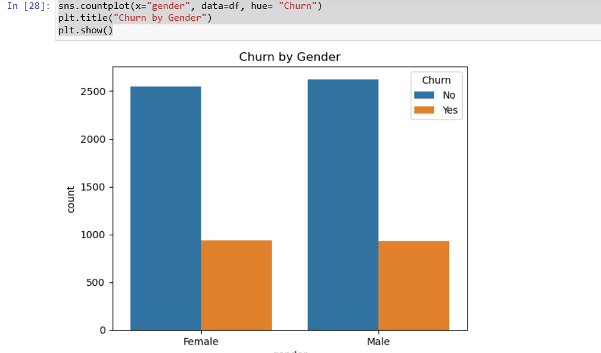

### 8. Churn by Gender
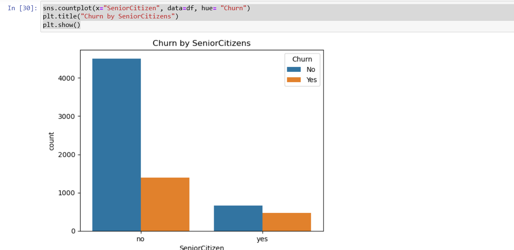

### 9. Churn by Senior Citizen Status
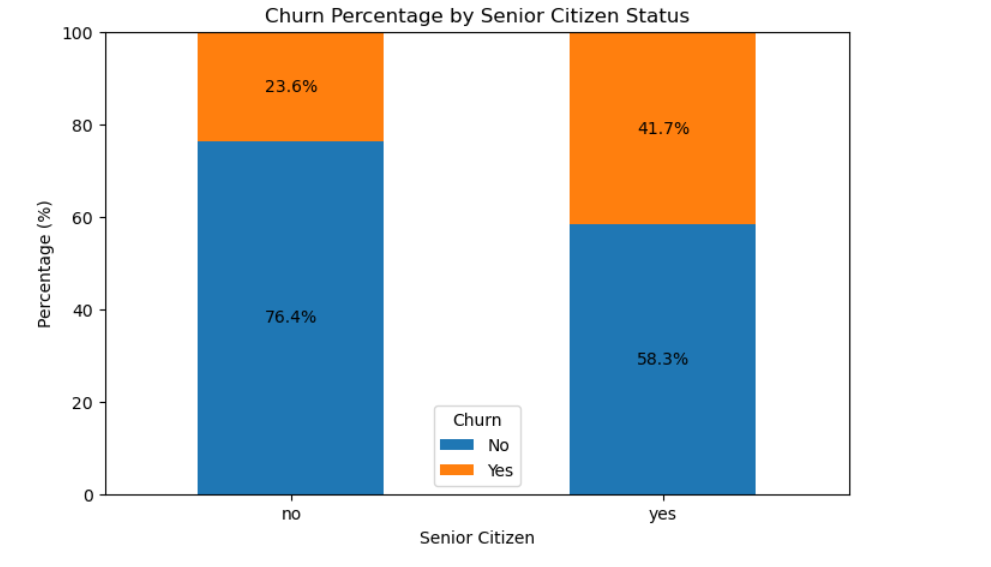

### 10. Churn Percentage by Senior Citizen Status
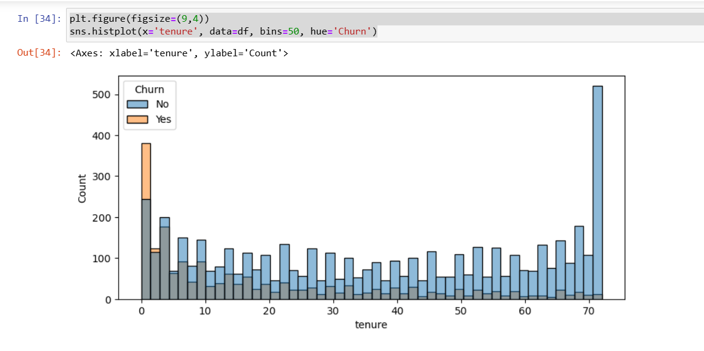

### 11. Churn by Tenure
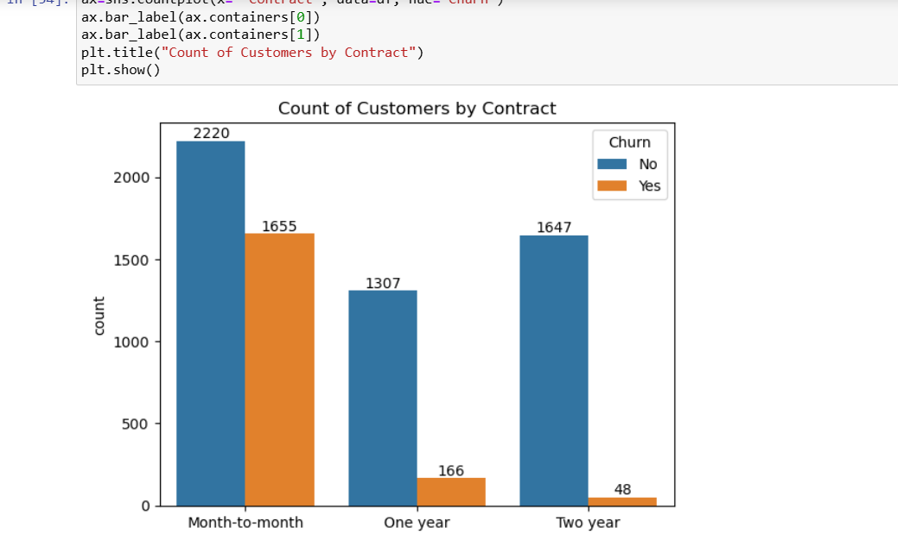

> ⚠️ Screenshot 12 is currently missing and will be added soon.

### 13. Churn by Contract Type
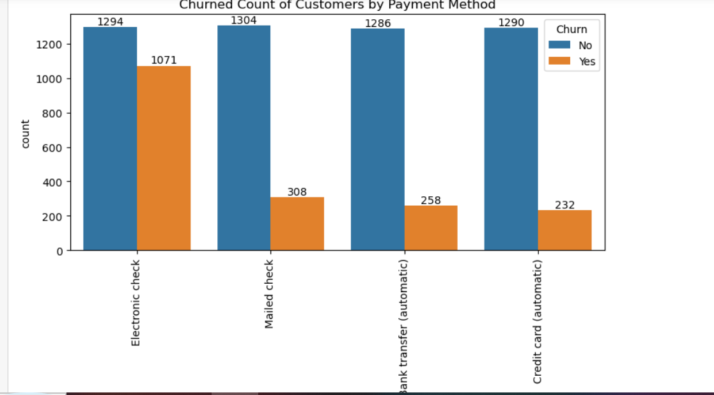

---

## 🚀 Getting Started

```bash
# Clone the repo
git clone https://github.com/<your-username>/customer-churn-analysis.git
cd customer-churn-analysis

# Install dependencies
pip install pandas numpy matplotlib seaborn jupyter

# Launch the notebook
jupyter notebook CustomerChurnAnalaysis.ipynb
```

---

## 📂 Project Structure

```
customer-churn-analysis/
├── CustomerChurnAnalaysis.ipynb   # Main analysis notebook
├── Customer Churn.csv             # Dataset
├── screenshots/                   # Notebook output screenshots
└── README.md
```

---

## 💡 Recommendations

- **Incentivize longer-term contracts** to reduce month-to-month churn
- **Strengthen onboarding** for new customers in their first few months
- **Prioritize retention outreach** to senior citizens
- **Investigate the electronic check experience** and encourage autopay migration
- **Promote security/support add-ons** as retention-boosting features

---

## 📌 Next Steps

- Build a predictive model (e.g., logistic regression / random forest) to estimate churn risk per customer
- Quantify the independent effect of each driver via feature importance
- Deploy insights into a live retention dashboard

---

## 📄 License

This project is open source and available under the [MIT License](LICENSE).
